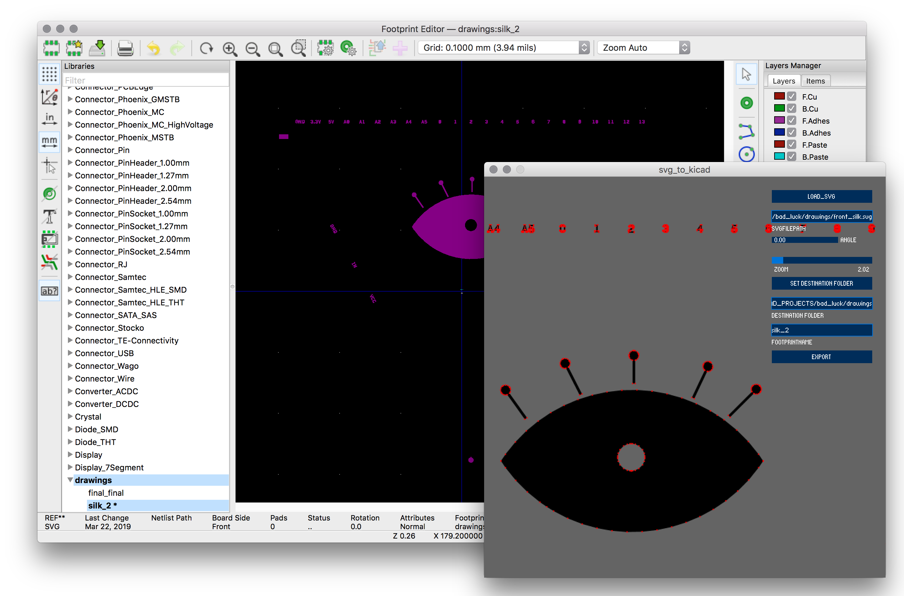

# SVG 2 Kicad
A simple processing sketch to convert svg files to kicad footprints.

Importing complex shapes as kicad components is always painful, I made this tool to try to smoothen the process.

The gui allows you to:
- Choose which svg file to open
- View the svg file and zoom in/out
- Visualize the points of the resilting path
- Select a folder where to export the component
- Export the svg to kicad.mod file

Still some work need to be done :) contributions are very welcomed

### TODO:
- [ ] Add toggle to switch between front/back silk
- [ ] Improve export of shapes with cutout parts
- [ ] check that the exported footprints have the same size of the imported one
- [ ] improve zoom mechanism

### MEANWHILE:
While I hope to find some time soon to fix and improve the tools I found an alternative workflow which eventually does what I needed. Instead of converting vectors to kicad component with this worflow I convert the silk directly to gerber.
Here the steps:
- Plot the your board to pdf, (one pdf per layer)
- Import the pdf in Illustrator and edit the silk layer (both for front and back silk)
- Export the silk as pdf
- Open the generated pdf with [Cennon](www.cenon.info) and export it in .gerber format
- Change the file extension to .gbr and rename it according to the file conventions used by kicad
- The exported file from Cennon has a different orientation compared to the .grb files exported by kicad
- Use [gerbv](http://gerbv.sourceforge.net/) to align the exported silk layers with the .grb files generated by kicad
- Verify that your vectors are all nicely aligned using [tracespace.io](tracespace.io) :)
